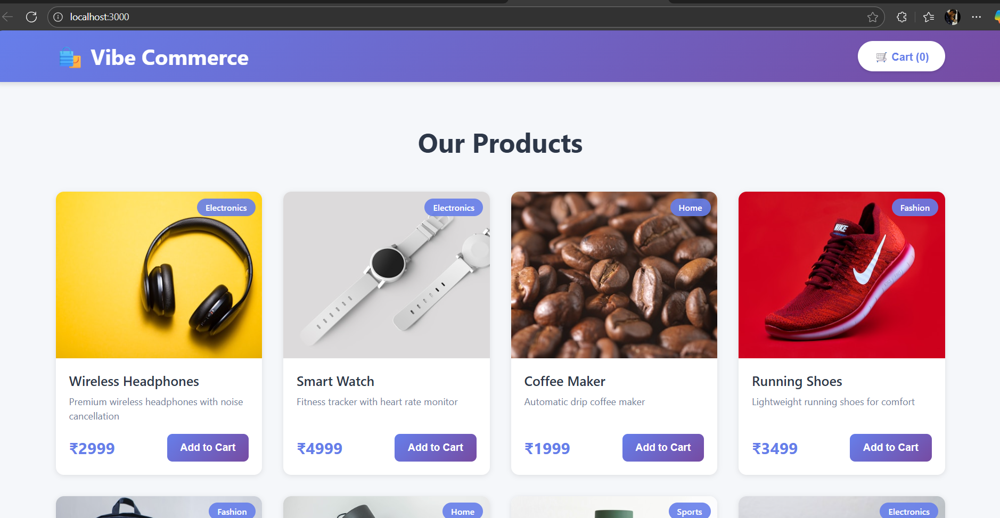
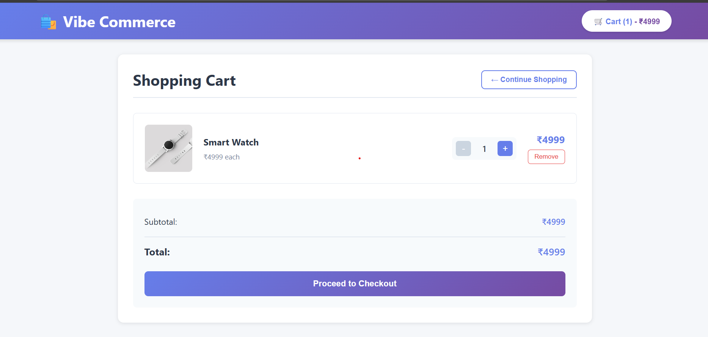
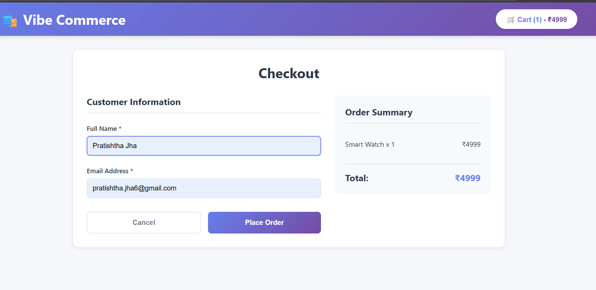

# 🛍️ Vibe Commerce Shopping Cart

A full-stack e-commerce shopping cart application built for Vibe Commerce technical assessment. Features product listing, cart management, checkout functionality, and MongoDB database integration.

## 📋 Overview

This project demonstrates a complete shopping cart solution with all essential e-commerce features including product browsing, cart operations, customer checkout, and order confirmation. Built with modern web technologies following industry best practices.

## ✨ Features

### Backend Features
- RESTful API architecture with Express.js
- MongoDB database with Mongoose ODM
- Complete CRUD operations for products and cart
- Mock checkout with receipt generation
- Error handling and validation
- CORS-enabled for cross-origin requests

### Frontend Features
- Responsive product grid with images and pricing
- Real-time shopping cart with dynamic updates
- Add, remove, and update item quantities
- Live total price calculation
- Customer checkout form with validation
- Order receipt modal with confirmation details
- Mobile-responsive design
- User-friendly notifications

## 🛠️ Tech Stack

**Frontend:**
- React.js (18.x)
- Axios for API communication
- CSS3 for styling
- React Hooks (useState, useEffect)

**Backend:**
- Node.js
- Express.js (4.x)
- MongoDB with Mongoose
- CORS middleware

## 📁 Project Structure
vibe-commerce-cart/
├── backend/
│ ├── server.js # Express server with all API endpoints
│ └── package.json # Backend dependencies
├── frontend/
│ ├── public/
│ │ └── index.html # Main HTML template
│ ├── src/
│ │ ├── components/
│ │ │ ├── Cart.jsx # Shopping cart component
│ │ │ ├── Cart.css # Cart styling
│ │ │ ├── CheckoutForm.jsx # Checkout form component
│ │ │ ├── CheckoutForm.css # Checkout styling
│ │ │ ├── ProductGrid.jsx # Products display component
│ │ │ ├── ProductGrid.css # Product grid styling
│ │ │ ├── ReceiptModal.jsx # Order receipt component
│ │ │ └── ReceiptModal.css # Receipt styling
│ │ ├── App.jsx # Main application component
│ │ ├── App.css # Application styling
│ │ ├── index.js # React entry point
│ │ └── index.css # Global styles
│ └── package.json # Frontend dependencies
└── README.md # Project documentation

text

## 🚀 Installation & Setup

### Prerequisites

Before running this project, ensure you have:
- Node.js (v14 or higher)
- MongoDB installed and running locally
- npm package manager

### Backend Setup

1. Navigate to the backend directory:
cd backend

text

2. Install dependencies:
npm install

text

3. Ensure MongoDB is running:
Windows
net start MongoDB

macOS/Linux
sudo systemctl start mongod

text

4. Start the backend server:
npm start

text

The backend server will run on `http://localhost:5000`

### Frontend Setup

1. Open a new terminal and navigate to the frontend directory:
cd frontend

text

2. Install dependencies:
npm install

text

3. Start the React application:
npm start

text

The application will automatically open at `http://localhost:3000`

**Important:** Both backend and frontend servers must be running simultaneously for the application to work properly.

## 🔗 API Endpoints

| Method | Endpoint | Description | Request Body | Response |
|--------|----------|-------------|--------------|----------|
| GET | `/api/products` | Fetch all products | None | Array of 10 products |
| GET | `/api/cart` | Get cart items and total | None | Cart object with items and subtotal |
| POST | `/api/cart` | Add item to cart | `{productId, qty}` | Updated cart |
| PUT | `/api/cart/:id` | Update item quantity | `{quantity}` | Updated cart |
| DELETE | `/api/cart/:id` | Remove item from cart | None | Updated cart |
| POST | `/api/checkout` | Process checkout | `{cartItems, customerName, customerEmail}` | Receipt with order details |
| GET | `/api/health` | Server health check | None | Server status |

## 💡 How to Use

1. **Browse Products:** View all available products on the homepage
2. **Add to Cart:** Click "Add to Cart" button on any product
3. **View Cart:** Click the "Cart" button in the header to see your items
4. **Manage Cart:** Use +/- buttons to adjust quantities or click "Remove" to delete items
5. **Checkout:** Click "Proceed to Checkout" button
6. **Enter Details:** Fill in your name and email in the checkout form
7. **Place Order:** Submit the form to complete your order
8. **View Receipt:** See your order confirmation with order ID and timestamp

## 📸 Screenshots

### Products Page

### Shopping Cart

### Checkout Form

### Order Receipt

## ✅ Requirements Checklist

**Backend:**
- ✅ GET /api/products endpoint with 10 mock items
- ✅ POST /api/cart endpoint for adding items
- ✅ DELETE /api/cart/:id for removing items
- ✅ GET /api/cart for retrieving cart
- ✅ POST /api/checkout for order processing

**Frontend:**
- ✅ Product grid with "Add to Cart" functionality
- ✅ Cart view with items, quantities, and total
- ✅ Remove and update buttons in cart
- ✅ Checkout form capturing name and email
- ✅ Receipt modal with order confirmation
- ✅ Responsive design

**Additional:**
- ✅ MongoDB database persistence
- ✅ Error handling throughout
- ✅ Clean code structure
- ✅ Documentation and setup instructions

## 🎓 Key Learning Outcomes

This project demonstrates proficiency in:
- Full-stack web application development
- RESTful API design and implementation
- React.js component architecture
- State management with React Hooks
- MongoDB/Mongoose database operations
- Asynchronous JavaScript (Promises/Async-Await)
- Frontend-backend integration via Axios
- Responsive web design
- Error handling and user experience

## 🔧 Technologies in Detail

**React Components:**
- Functional components with Hooks
- Component composition and reusability
- Props and state management
- Conditional rendering
- Event handling

**Node.js/Express:**
- Route handling
- Middleware implementation
- MongoDB connection and queries
- JSON data handling
- CORS configuration

## 👨‍💻 Developer

**Pratishtha Jha**
- Email: pratishtha.jha6@gmail.com
- GitHub: [Your GitHub Profile Link]

## 📅 Project Timeline

- Assignment Received: October 28, 2025
- Development Period: October 28-29, 2025
- Completed: October 29, 2025
- Submission Deadline: October 30, 2025

## 📝 Notes

- This is a mock e-commerce application created for educational and assessment purposes
- No real payment processing is implemented
- Product data is hardcoded in the backend server
- MongoDB is used for local data persistence
- CORS is enabled for development purposes only

## 🙏 Acknowledgments

Thank you to Vibe Commerce for providing this opportunity to demonstrate full-stack development capabilities through this technical assignment.

---

**Built with ❤️ by Pratishtha Jha | October 2025**

